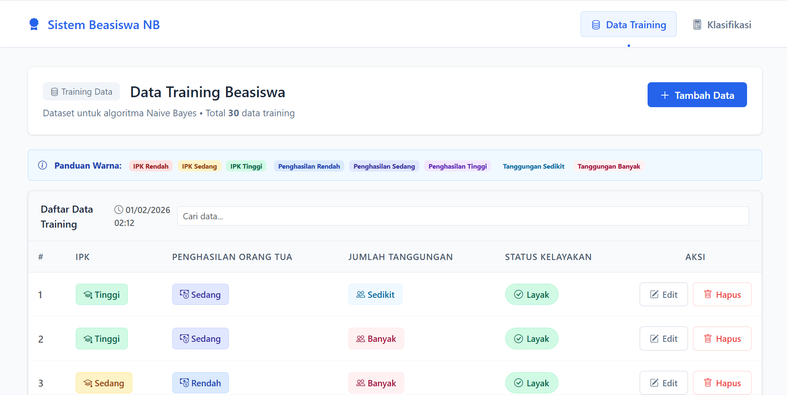
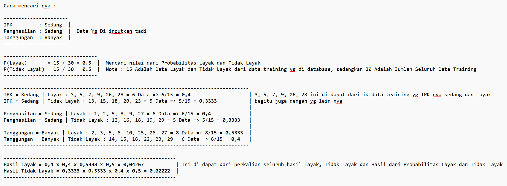

# 🎓 Aplikasi Klasifikasi Kelayakan Beasiswa
## Berbasis Web Menggunakan Algoritma Naive Bayes



Aplikasi ini merupakan sistem berbasis web yang digunakan untuk **menentukan kelayakan penerima beasiswa** berdasarkan data akademik dan ekonomi mahasiswa.  
Sistem ini dibuat untuk keperluan **akademik (Data Mining)** dan mengimplementasikan algoritma **Naive Bayes** pada data kategorikal.

---

## 🚀 Tech Stack

- Backend Framework : [**Laravel (PHP)**](https://laravel.com/docs)
- Database : **MySQL**
- Frontend : **Blade Template**
- Styling : **Bootstrap 5**
- Algoritma : **Naive Bayes**
- Authentication : **Session-based Login (Custom)**

---

## ✨ Fitur Utama

- 🔐 **Login Admin**
  - Autentikasi menggunakan session
  - Proteksi halaman dengan middleware

- 📊 **CRUD Data Training**
  - Kelola data training (tambah, ubah, hapus)
  - Data digunakan sebagai dasar perhitungan klasifikasi

- 🤖 **Klasifikasi Kelayakan Beasiswa**
  - Input data uji (IPK, Penghasilan, Tanggungan)
  - Sistem menghitung probabilitas Layak dan Tidak Layak
  - Menampilkan keputusan akhir secara otomatis

- 💾 **Penyimpanan Hasil**
  - Hasil klasifikasi disimpan ke database
  - Digunakan sebagai riwayat klasifikasi

---

## 🧠 Proses Perhitungan Naive Bayes

Berikut adalah contoh **proses pencarian dan perhitungan probabilitas Naive Bayes** berdasarkan data training dan data uji yang diinputkan oleh pengguna:



> Gambar di atas menunjukkan proses perhitungan probabilitas prior, likelihood setiap atribut, serta hasil akhir klasifikasi Layak dan Tidak Layak.

---

## 📂 Project Structure

```bash
beasiswa-nb/
│
├── app/
│   ├── Http/
│   │   ├── Controllers/
│   │   └── Middleware/
│   └── Models/
│
├── resources/
│   └── views/
│       ├── auth/
│       ├── training/
│       └── klasifikasi/
│
├── routes/
│   └── web.php
│
├── public/
│   └── images/
│
├── .env.example
├── composer.json
└── README.md
```

## 🛠️ Getting Started

### 1. Clone Repository

```bash
  git clone https://github.com/TriRestuSanubari/beasiswa-nb.git
  cd beasiswa-nb
```

### 2. Install Dependencies

```bash
composer install
```

### 3. Setup Environment Variables

Buat file .env berdasarkan .env.example

```bash
cp .env.example .env
php artisan key:generate
```

Lalu Atur koneksi database pada file .env

### 4. Run Development Server

```bash
php artisan serve
```

Server akan berjalan di: http://127.0.0.1:8000

### 4. Run Development Server

Email    : admin@beasiswa.com
Password : admin123

## 🌐 Live Demo

[beasiswa-nb](http://klasifikasi-beasiswa-nb.infinityfreeapp.com/)